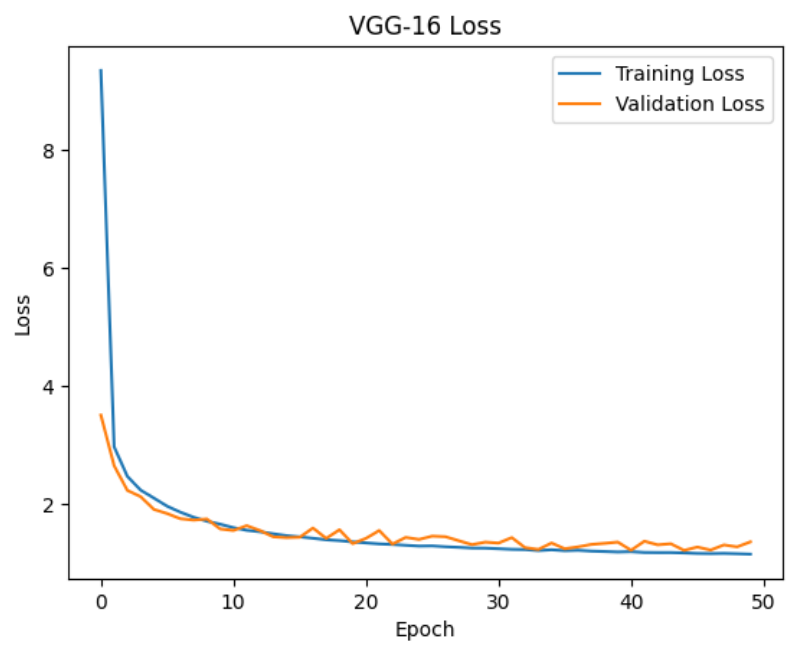
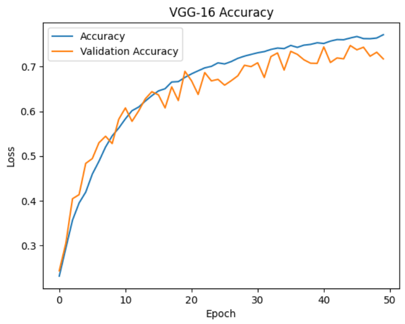
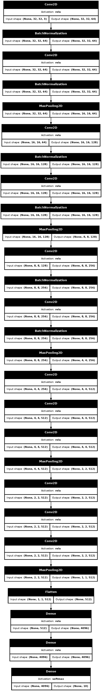

# VGG-16

* a CNN model created by the Visual Geometry Group at the University of Oxford

* initially contained 16 weight layers

## Results

* Accuracy peaked at 77% due to physical machine constraints

### Loss

### Accuracy

## Model Architecture

